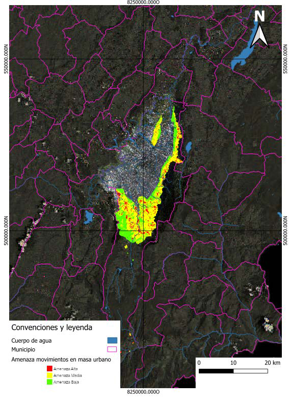
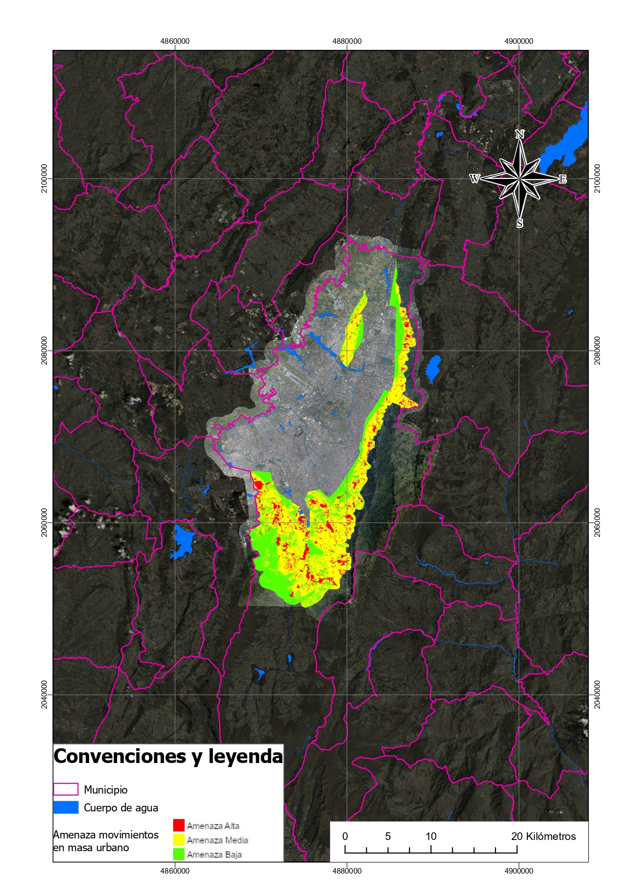

# Introducción

La interoperabilidad en los Sistemas de Información Geográfica (SIG) permite la integración de datos provenientes de múltiples fuentes mediante estándares abiertos definidos por el **Open Geospatial Consortium (OGC)**.

Estos estándares facilitan la conexión entre plataformas SIG, bases de datos espaciales y servicios web geográficos, permitiendo que diferentes aplicaciones puedan compartir información sin importar el software utilizado.

En esta práctica se evaluó la conexión a diversos servicios geográficos disponibles en Colombia, utilizando herramientas como **QGIS** y **ArcGIS Pro**, con el objetivo de analizar la disponibilidad de datos, la posibilidad de edición, el acceso a atributos y las opciones de visualización cartográfica.

---

# Objetivos

## Objetivo General

Analizar la conexión y navegación de servicios geográficos remotos y datos locales dentro de un entorno SIG.

## Objetivos Específicos

- Identificar los principales estándares de interoperabilidad geográfica.
- Conectarse a servicios WMS, WFS y WCS disponibles en Colombia.
- Integrar datos locales en formato Shapefile y GeoTIFF.
- Analizar las capacidades de edición, visualización y consulta de atributos.

---

# Marco Teórico

## Interoperabilidad en SIG

La interoperabilidad permite que distintos sistemas puedan intercambiar información geográfica sin perder su estructura ni significado.

Los estándares del **OGC** facilitan este proceso mediante protocolos y formatos que permiten compartir datos espaciales en internet.

## Estándares OGC utilizados

### WMS – Web Map Service

Permite visualizar mapas generados en el servidor remoto.  
El usuario recibe únicamente una **imagen renderizada del mapa**, por lo que no es posible editar los datos.

Características:

- Visualización de mapas remotos
- No permite edición
- No permite acceso a tabla de atributos
- Alta compatibilidad con clientes SIG

### WFS – Web Feature Service

Permite acceder a **datos vectoriales completos**, incluyendo su geometría y tabla de atributos.

Características:

- Permite consultas espaciales
- Permite edición si está habilitado como **WFS-T**
- Permite descarga de datos

### WCS – Web Coverage Service

Proporciona acceso a **datos raster geoespaciales**, como imágenes satelitales o modelos de elevación.

Características:

- Entrega coberturas raster
- Permite análisis espacial
- No maneja geometrías vectoriales

---

# Tabla de Fuentes de Información

| Tipo | Nombre | Fuente | Sistema de Coordenadas |
|------|------|------|------|
| WMS | Amenaza Movimientos en Masa Bogotá | Catastro Bogotá | EPSG:4326 |
| WFS | Límites territoriales de Colombia | IGAC | EPSG:9377 |
| WCS | Ortoimagen Bogotá 2017 | UAECD | EPSG:4326 |
| Shapefile | Cuerpo de Agua Bogotá | Datos Abiertos Bogotá | EPSG:4326 |
| GeoTIFF | Ortoimagen Cundinamarca | IGAC | EPSG:9377 |

---

# Metodología

La metodología aplicada en esta práctica consistió en los siguientes pasos:

1. Identificación de servicios geográficos disponibles en portales oficiales.
2. Conexión a servicios WMS, WFS y WCS desde software SIG.
3. Descarga e incorporación de datos locales.
4. Evaluación de la capacidad de edición y consulta.
5. Generación de mapas y exportación cartográfica.

---

# Productos Cartográficos

## Mapa generado en QGIS

El mapa generado en QGIS integra diferentes fuentes de información geográfica, incluyendo servicios web y datos locales. La simbología aplicada permite identificar claramente los diferentes elementos del territorio.

## Mapa generado en ArcGIS Pro

Este mapa muestra la integración de servicios remotos dentro del entorno de ArcGIS Pro, destacando la visualización de capas raster y vectoriales.

---

# Análisis de Resultados

## Edición de geometrías

Los formatos que permiten edición directa son:

- Shapefile
- WFS (cuando está habilitado como WFS-T)

Los servicios que **no permiten edición** son:

- WMS
- WCS

Esto se debe a que estos servicios entregan únicamente imágenes o coberturas raster sin geometrías editables.

## Acceso a tabla de atributos

Se identificó que los siguientes formatos permiten acceso a tabla de atributos:

- Shapefile
- WFS

En contraste, los servicios WMS no proporcionan información tabular asociada a las capas.

## Cambio de simbología

Fue posible modificar la simbología en:

- Shapefile
- WFS
- GeoTIFF
- WCS

Sin embargo, en los servicios WMS la simbología está definida por el servidor remoto.

---

# Discusión

El uso de servicios geográficos interoperables representa una ventaja significativa en proyectos de gestión territorial, planificación urbana y análisis ambiental.

Los servicios WFS permiten acceder a información actualizada en tiempo real, evitando la duplicación de datos y facilitando el trabajo colaborativo entre diferentes instituciones.

Por otro lado, los servicios WMS resultan especialmente útiles para visualización rápida de información geográfica sin necesidad de descargar grandes volúmenes de datos.

---

# Conclusiones

La práctica permitió comprender el funcionamiento de los servicios geográficos interoperables y su integración dentro de los sistemas de información geográfica.

Los resultados obtenidos demuestran que los estándares del OGC facilitan la interoperabilidad entre diferentes plataformas SIG, permitiendo la integración de datos locales y remotos.

Finalmente, el uso de servicios web geográficos contribuye a mejorar la gestión de la información territorial y a fortalecer la toma de decisiones basada en datos espaciales.