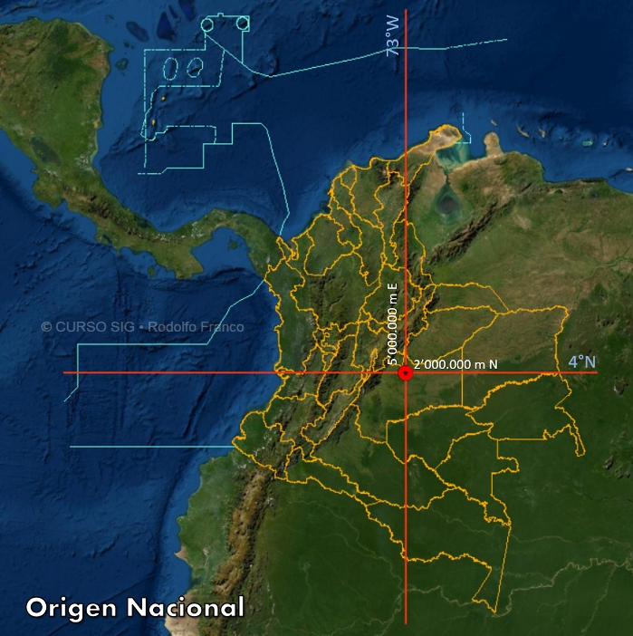
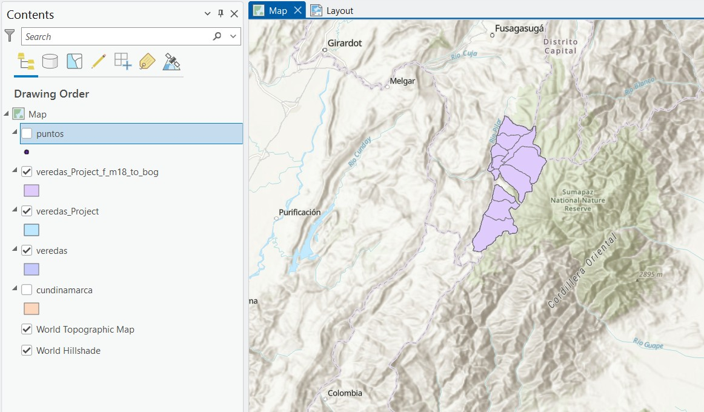
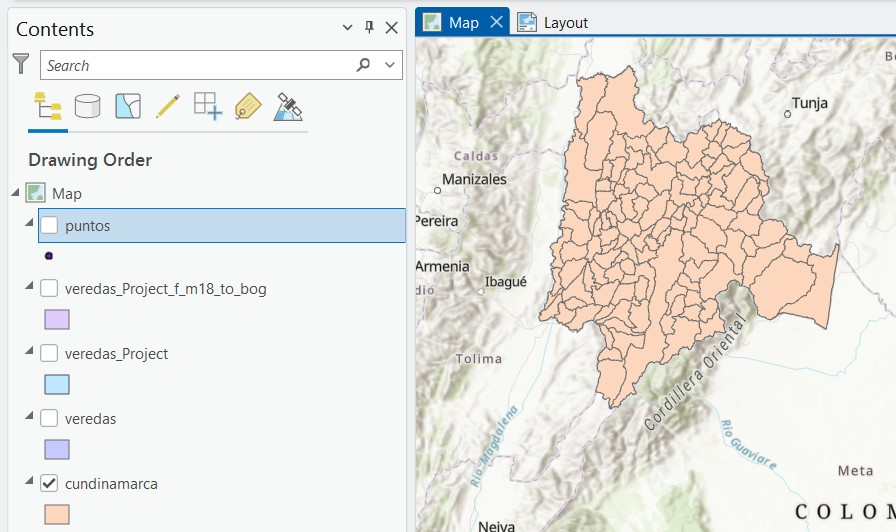
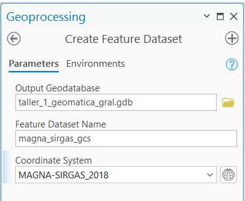
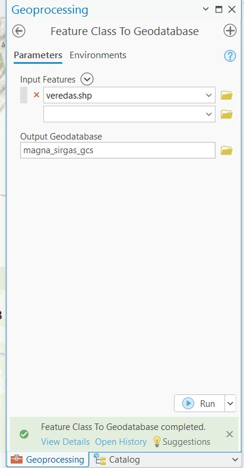
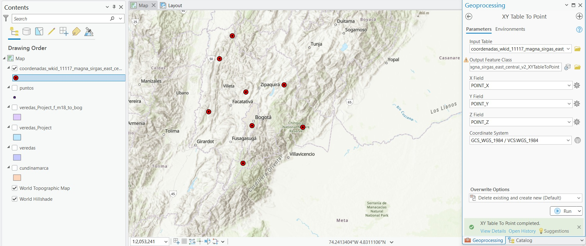

# Introducción

Los sistemas de coordenadas permiten representar información geográfica con precisión.  
En Colombia se ha producido una transición desde el datum **Bogotá 1975** hacia el sistema geodésico moderno **MAGNA-SIRGAS**, el cual constituye actualmente el marco oficial de referencia.

La correcta identificación del sistema de coordenadas es fundamental para evitar errores en análisis espaciales dentro de los Sistemas de Información Geográfica.

Trabajar con sistemas de referencia incorrectos puede generar desplazamientos espaciales significativos entre capas geográficas.

---

# Revisión de archivos espaciales

Los datos utilizados fueron analizados en **ArcGIS Pro**.  
Se revisaron diferentes capas en formato **Shapefile**, verificando si cada archivo tenía definido su sistema de referencia.

Un Shapefile está compuesto por varios archivos asociados:

- `.shp` → geometría  
- `.dbf` → tabla de atributos  
- `.shx` → índice  
- `.prj` → sistema de coordenadas  

Cuando el archivo `.prj` no existe, el sistema de referencia del dataset no puede identificarse automáticamente.

---

# Sistema Bogotá 1975

En el archivo `cundinamarca.shp` fue necesario definir el sistema de coordenadas utilizando la herramienta **Define Projection**.

El sistema asignado fue:

- **GCS_Bogota**
- Datum: Bogotá 1975
- EPSG: 4218

Este datum corresponde a un sistema geodésico antiguo basado en el elipsoide **International 1924**.

---

# Sistema MAGNA-SIRGAS y Origen Nacional

El sistema oficial en Colombia es **MAGNA-SIRGAS**.  
Desde el año 2020 se implementó el **Origen Nacional**, que permite unificar la cartografía del país bajo un único sistema proyectado.

Parámetros principales:

| Parámetro | Valor |
|-----------|------|
| Latitud de origen | 4° N |
| Longitud de origen | 73° W |
| Falso Este | 5 000 000 m |
| Falso Norte | 2 000 000 m |

---

# Transformación de sistemas de coordenadas

Para adaptar los datos al sistema oficial se utilizó la herramienta **Project** de ArcGIS.

El archivo `veredas.shp` fue reproyectado hacia MAGNA-SIRGAS generando una nueva capa denominada `veredas_magna`.

Durante este procedimiento se aplicó una transformación geográfica para ajustar el cambio de datum.

---

# Proyección al vuelo

ArcGIS permite visualizar capas con sistemas distintos mediante el proceso denominado **proyección al vuelo**, el cual realiza conversiones temporales en memoria sin modificar los datos originales.

Para formalizar el cambio se exportó la capa utilizando el sistema del mapa.

---

# Importación a Geodatabase

Posteriormente se creó un **dataset** dentro de una File Geodatabase con sistema MAGNA-SIRGAS.

Luego se importó el shapefile de veredas dentro del dataset.

---

# Generación de puntos desde coordenadas

También se generó una capa de puntos a partir de una tabla de coordenadas utilizando la herramienta **XY Table To Point**.

Este procedimiento permite convertir registros tabulares en entidades espaciales dentro del sistema de referencia seleccionado.

---

# Conclusiones

El ejercicio permitió comprender la importancia de los sistemas de referencia espacial en el manejo de información geográfica.

Se evidenció que la ausencia del archivo `.prj` puede generar problemas al identificar el sistema de coordenadas de un dataset.

Asimismo, se observó la diferencia entre **definir un sistema de coordenadas** y **transformar datos entre sistemas distintos**.

Finalmente, se confirmó que **MAGNA-SIRGAS con Origen Nacional** constituye actualmente el estándar cartográfico utilizado en Colombia.

Antes de iniciar cualquier análisis espacial siempre es recomendable verificar el código **EPSG** del sistema de coordenadas utilizado.